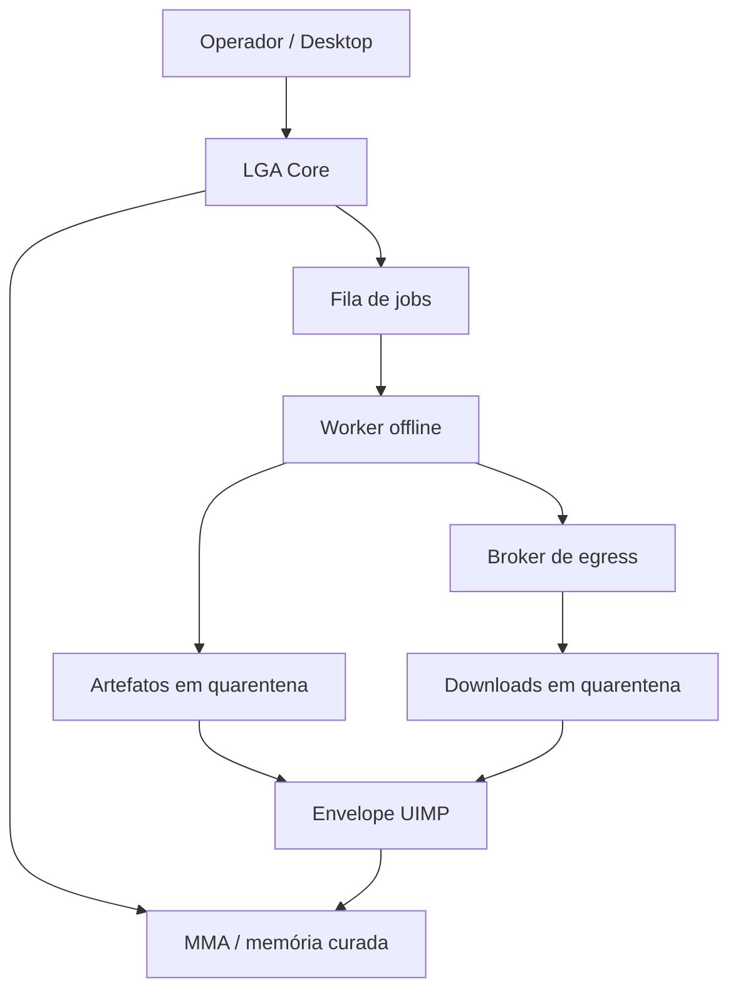

# Arquitetura da WorkSpace

## Objetivo

A WorkSpace fornece um sistema operacional de desenvolvimento para a LGA sem
confundir capacidade de execução com autoridade. O operador usa um desktop
normal; ações autônomas passam por serviços e identidades separados.

## Identidades

### `workspace`

Conta humana da sessão live. Tem acesso ao desktop e aos aplicativos gráficos,
mas não possui sudo. Não é a identidade usada pelos jobs autônomos. Pode
iniciar/parar somente as unidades `lga-learning@*.service` pela regra de
Polkit.

### `operator`

Identidade isolada disponível em `tty3`, fora da sessão gráfica. Recebe uma
senha aleatória em cada boot e entra por autologin somente naquele TTY. Sua
única regra de sudo permite iniciar o `archinstall`; não pode ser assumida pelo
desktop com a senha conhecida da sessão live.

### `lga-runner`

Conta de sistema sem shell. Executa um job por unidade systemd. Não recebe rede,
home, dispositivos físicos ou capabilities. Sua escrita é limitada ao job,
workspace e diretório de artefatos.

### `lga-egress`

Conta de sistema que mantém o broker de aquisição. Ela é a única identidade
desse caminho com acesso IPv4/IPv6 e grava apenas em quarentena e auditoria.

## Fluxo de aprendizado

1. O Core ou operador cria `/var/lib/lga/jobs/<id>/job.json`.
2. `workspace-job start <id>` pede ao systemd o início da unidade.
3. O runner valida ID, executável, diretório e limites do manifesto.
4. O systemd cria namespaces e aplica limites de CPU, RAM, processos e tempo.
5. O processo escreve somente em seu workspace e em artefatos.
6. Se precisar de material externo, chama `workspace-fetch`; o broker valida
   HTTPS, host, redirects, IPs e tamanho antes de colocar o arquivo em
   quarentena.
7. Saídas destinadas à arquitetura são empacotadas como `.uimp` e validadas.
8. O MMA decide se evidência suficiente existe para promover a memória. A
   WorkSpace nunca promove automaticamente uma hipótese a regra.

## UIMP 0.1

Nesta versão de integração, `.uimp` é um ZIP determinístico com:

- `manifest.json` UTF-8;
- payloads dentro de `payload/`;
- SHA-256 e tamanho de cada payload;
- origem, destino, protocolo especializado, prioridade, contexto e trace;
- limites contra path traversal, zip bombs, entradas duplicadas e symlinks.

O formato 0.1 é deliberadamente pequeno. Ele não pretende congelar o protocolo
final; `uimp_version` permite evolução compatível.

## Compatibilidade NanoLGA

O código de referência fica em `/opt/lga/nanolga` e é chamado por wrappers que
fixam `PYTHONPATH`. Sessões humanas usam o SQLite em
`$XDG_STATE_HOME/nanolga`; serviços do Core devem apontar explicitamente para
`/var/lib/lga/memory`. O desktop pode
usar `nanolga-desktop-bridge`, cujo protocolo JSONL continua separado da UI.

## Pacotes e atualizações

O repositório mantém apenas pacotes oficiais do Arch nos manifests da ISO. O
perfil base não é copiado permanentemente: `prepare-profile.sh` parte do
`releng` da versão instalada do ArchISO, preservando a estrutura de boot atual.
Cada build registra a lista resolvida e o checksum da ISO, mas não é
bit-a-bit reproduzível entre snapshots diferentes do Arch. Dependências de
projeto adicionais devem entrar em ambientes virtuais ou
containers supervisionados, nunca no sistema base por decisão da IA.
