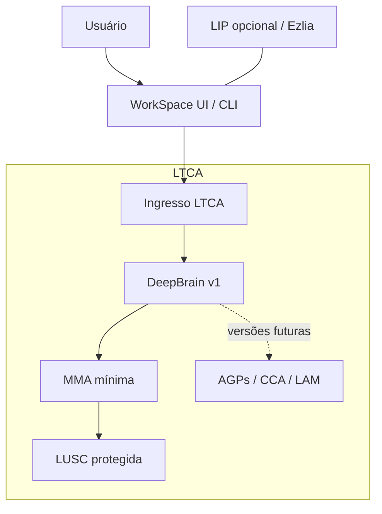

# Arquitetura da WorkSpace

## Papel da distribuição

A WorkSpace fornece o sistema operacional de interação e desenvolvimento da
LGA sem confundir capacidade de execução com autoridade cognitiva. Ela é um
cliente externo da LTCA e uma superfície humana supervisionada; o DeepBrain não
é um endpoint público hospedado diretamente pelo desktop.

O arquivo `/etc/lga/architecture.toml` registra esta topologia de forma
legível por máquina.

```mermaid
flowchart TD
    U[Usuário] --> W[WorkSpace UI / CLI]
    P[LIP opcional / Ezlia] --- W
    W --> I[Ingresso LTCA]
    subgraph LTCA
        I --> D[DeepBrain v1]
        D --> M[MMA mínima]
        M --> L[LUSC protegida]
        D -. versões futuras .-> A[AGPs / CCA / LAM]
    end
```

## Rota v1

1. A pessoa ou cliente inicia uma solicitação na WorkSpace.
2. A WorkSpace autentica e envia a informação ao ingresso da LTCA.
3. A LTCA valida, roteia e entrega a solicitação ao DeepBrain v1 interno.
4. Quando precisa de memória ou sources, o DeepBrain consulta a MMA mínima.
5. Somente a MMA atravessa a fronteira protegida da LUSC.
6. A resposta retorna pelo ingresso para a WorkSpace.

AGPs, CCA, LAM avançada, standby avançado, TTS, STT, visão, robótica e uma LIP
multimodal ficam adiados. O cliente v1 não deve fingir que esses componentes
estão ativos.

## Nomenclatura canônica

| Sigla/nome | Expansão ou função |
| --- | --- |
| LGA | Learning Generative Architecture |
| DeepBrain | núcleo/orquestrador interno da LTCA |
| AGP | Assistant Generative Processor |
| CCA | Cognitive Choice Agent |
| MMA | Memory Manager Agent |
| LTCA | LGA Transmission Cloud Architecture |
| LUSC | LGA Universal Source Cloud |
| LAM | LGA Asynchronous Messaging |
| UIMP | Universal Information Management Protocol |
| LIP | LGA Intelligent Persona |

Em português, a documentação da WorkSpace usa **a LGA** por referência a “a
arquitetura”, **o DeepBrain** por referência a “o núcleo/serviço” e **a LIP**
por referência a “a persona”. Isso é uma convenção gramatical, não uma
atribuição de gênero à inteligência subjacente.

Ezlia é uma LIP pré-instalada e opcional. Ela é a identidade física e
conversacional apresentada ao usuário, não um AGP, serviço de decisão ou
substituto do DeepBrain. Sem LIP, a arquitetura usa o modo normal de fala.

## Identidades do sistema operacional

### `workspace`

Conta humana da sessão live. Tem acesso ao desktop e aplicativos gráficos, mas
não possui sudo. Não é a identidade usada por jobs autônomos. Pode
iniciar/parar somente unidades `lga-learning@*.service` pela regra de Polkit.

### `operator`

Identidade bloqueada e isolada em `tty3`, fora da sessão gráfica. O autologin é
feito localmente pelo `agetty` root-owned; a conta não possui senha conhecida.
Sua única regra de sudo permite iniciar `archinstall`, portanto o desktop não
consegue usar a credencial `workspace` como atalho para root.

### `lga-runner`

Conta de sistema sem shell. Executa um job por unidade systemd. Não recebe rede,
home, dispositivos físicos ou capabilities. Sua escrita é limitada ao job,
workspace e diretório de artefatos.

### `lga-egress`

Conta de sistema que mantém o broker de aquisição. É a única identidade desse
caminho com acesso IPv4/IPv6 e grava apenas em quarentena e auditoria.

## Fluxo de experimentação restrita

Este fluxo pertence à WorkSpace e não substitui o fluxo cognitivo da LTCA:

1. O operador ou um futuro cliente autorizado cria
   `/var/lib/lga/jobs/<id>/job.json`.
2. `workspace-job start <id>` pede ao systemd o início da unidade.
3. O runner valida ID, executável, diretório e limites do manifesto.
4. O systemd cria namespaces e aplica limites de CPU, RAM, processos e tempo.
5. O processo escreve somente em seu workspace e em artefatos.
6. Aquisições externas passam pelo broker, que valida HTTPS, host, redirects,
   IPs e tamanho antes de gravar em quarentena.
7. Saídas destinadas à arquitetura são empacotadas em `.uimp` e validadas.
8. A WorkSpace não promove o resultado diretamente a memória da LUSC; isso
   exige a rota LTCA → MMA.

## UIMP 0.1 integrado

Nesta distro, `.uimp` é um envelope ZIP determinístico com:

- `manifest.json` UTF-8;
- payloads dentro de `payload/`;
- SHA-256 e tamanho de cada payload;
- origem, destino, protocolo especializado, prioridade, contexto e trace;
- limites contra path traversal, zip bombs, entradas duplicadas e symlinks.

O destino padrão passou a ser `ltca-ingress`. Essa implementação é um perfil de
integração local 0.1 e não congela o repositório, hash ou schema canônico do
UIMP, que ainda precisa ser fixado pela arquitetura.

## Compatibilidade NanoLGA

O código de referência fica em `/opt/lga/nanolga`. Ele exercita a topologia
madura com DeepBrain/Core, AGPs, CCA e MMA para testes de contratos, mas não é a
rota mínima da LGA v1. Sessões humanas usam SQLite em
`$XDG_STATE_HOME/nanolga`; esse banco é estado de laboratório, não a LUSC.

O desktop legado pode usar `nanolga-desktop-bridge`, cujo protocolo JSONL
continua separado da UI. A presença do laboratório não autoriza a interface a
mostrar AGPs, tarefas ou telemetria fictícios.

## Pacotes e atualizações

O repositório mantém apenas pacotes oficiais do Arch nos manifests da ISO. O
perfil base não é copiado permanentemente: `prepare-profile.sh` parte do
`releng` da versão instalada do ArchISO. Cada build registra a lista resolvida
e o checksum da ISO, mas não é bit-a-bit reproduzível entre snapshots
diferentes do Arch. Dependências adicionais entram em ambientes virtuais ou
containers supervisionados, nunca no sistema base por decisão autônoma.
