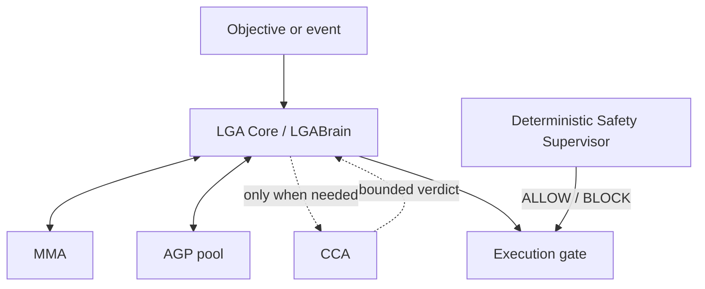

# NanoLGA v0.1

Reference prototype of the **Learning Generative Agent** architecture: one
executive Core, replaceable specialist AGPs, an on-demand CCA, curated memory,
and a deterministic safety authority outside model control.

This is an executable architectural baseline, not a claim of consciousness,
general autonomy, industrial certification, or proven superiority over
monolithic agents.

## Current topology



The central box is called **LGA Core** in the architecture. `LGABrain` is the
executive software component inside it. The complete set of boxes is the LGA.

## What is implemented

- operational state machine: Deep Standby → Pre-Awake → Awake → Task
  Finalization → Idle-Learning;
- strict Python contracts for tasks, plans, actions, AGP reports, CCA verdicts,
  safety decisions and memories;
- Core-controlled planning, delegation, synthesis and semantic-memory curation;
- direct Core ↔ AGP reports with no MMA reference exposed to AGPs;
- selective four-role CCA deliberation;
- deterministic, fail-closed Safety Supervisor;
- raw event log plus candidate/active/stale semantic memory in SQLite;
- configurable evidence threshold before a candidate becomes active;
- zero-dependency Groq adapter using JSON mode and bounded retries;
- offline deterministic provider for tests and architecture demonstrations;
- Calculator and General AGPs;
- CLI for tasks, memory inspection and confirmation/contradiction feedback.

## Run it now

Python 3.11 or newer is required. No third-party runtime dependency is needed.

```bash
cd nanolga
PYTHONPATH=src python -m nanolga demo --json
```

Or install the local command:

```bash
python -m pip install -e .
nanolga demo
```

The offline demo should finish with `Resultado: 120` and return the Runtime to
Deep Standby.

## Connect Groq

Keep the key outside source code:

```bash
export GROQ_API_KEY="your-key"
nanolga run "Crie um plano curto para validar a NanoLGA" --provider groq
```

Default routing:

| Role | Default model |
| --- | --- |
| LGA Core | `openai/gpt-oss-20b` |
| CCA | `openai/gpt-oss-20b` |
| Generative AGPs | `llama-3.1-8b-instant` |

The IDs are configuration, not architecture. Change them with the environment
variables shown in `.env.example`.

## Memory does not silently become truth

Core synthesis creates **candidate memories**. With the provisional policy, a
candidate needs three confirmations, no contradiction and sufficient confidence
before it is retrieved as active context:

```bash
nanolga memories --status candidate
nanolga feedback MEMORY_ID confirm
```

Thresholds are explicit configuration because the correct values must be
validated empirically. Idle-Learning reports pending deltas but never promotes a
memory by itself in v0.1.

## Test the boundaries

```bash
PYTHONPATH=src python -m unittest discover -s tests -v
```

The tests verify the complete offline loop, selective CCA activation, mandatory
human approval for high risk, fail-safe S1 behavior, immutable safety blocks,
AGP memory isolation and evidence-based memory promotion.

## Deliberate v0.1 limitations

- one logical Core processes one task at a time;
- CCA performs its four roles in one structured model call to preserve the free
  API budget;
- a `REVISE` verdict stops safely instead of entering an unbounded replan loop;
- semantic retrieval is bounded lexical scoring, not embeddings;
- no shell, filesystem mutation, network tool or physical actuator AGP exists;
- S0/S1 are architecture hooks, not industrial safety certification;
- Core-2, task leases, idempotency and distributed consistency are deferred.

See [Architecture](docs/ARCHITECTURE.md) and [Open questions](docs/OPEN_QUESTIONS.md).
